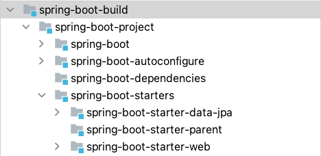

[Spring](https://spring.io/) changed the way alot of programmers thought about dependency
injection.  [Spring Boot's](https://spring.io/projects/spring-boot) aim was to tighten the dependency chain with Spring,
and provide autoconfiguration that allows programmers to start developing applications with minimum fuss.

**This same philosophy can be applied for an internal library that any enterprise could benefit from.**

Before jumping right in, I think its a good idea to understand the original Spring Boot libraries Maven structure:



Here are some highlights about how the Spring Team constructed it:

- **spring-boot** - Main library and can provide features for all of Spring Boot.
- **spring-boot-autoconfigure** - Configures large parts of the application based of the contents of their classpath,
  usually by providing beans a user might require. (_This is where alot of the 'spring magic' happens._)
- **spring-boot-dependencies** - Manages all the dependency versions, including 3rd party and Spring Boot itself.
- **spring-boot-starter/spring-boot-starter-parent** - Parent pom library to provide Spring Boot to an application.
- **spring-boot-starter/spring-boot-starter-web** - Web application Spring Boot starter providing all the dependencies
  to create a Web app.

_Each module allows for targeted layers of configuration. Whether it be the entire Spring Boot library, or just the
autoconfiguration libraries, each one has its dedicated purpose that doesn't interfere with other parts of the library._

If we adopt this same structure, we can build our own Spring Boot Enterprise libraries. Any internal libraries a company
produces or 3rd party dependencies can be vetted for compatability and locked in to specific versions before release.
New starters with autoconfiguration beans can be created to allow for reduced code complexity. This is in addition to
getting all the Spring Boot BOM and autoconfiguration for free.

**We can create an internal 'Spring Boot Enterprise' library by adopting the Spring Boot project structure and linking
the Spring Boot parent pom in the root project:**

```xml

<project xmlns="http://maven.apache.org/POM/4.0.0"
         xmlns:xsi="http://www.w3.org/2001/XMLSchema-instance"
         xsi:schemaLocation="http://maven.apache.org/POM/4.0.0 http://maven.apache.org/xsd/maven-4.0.0.xsd">
    <modelVersion>4.0.0</modelVersion>
    <parent>
        <groupId>org.springframework.boot</groupId>
        <artifactId>spring-boot-starter-parent</artifactId>
        <version>${spring.boot.version}</version>
        <relativePath/> <!-- lookup parent from repository -->
    </parent>
    <groupId>com.enterprise</groupId>
    <artifactId>spring-boot-enterprise-build</artifactId>
    ...
</project>
``` 

Whenever a new Spring Boot version is released, we just need to bump the libraries parent-pom version and re-test. Then
we can cut a release and distribute the updated version to all of our application developers in the enterprise.

**This consolidation of libraries allows an internal team to focus on dependency compatability for the entire company,
freeing up application developers to develop, what else, apps!**

**Cloud Platform teams should have one goal, make development easier for developers**. Writing internal libraries is
hard, but using Spring Boot patterns can help make them a little more manageable. Check out the sample
code [here](https://github.com/seaniegleason/spring-boot-enterprise).

In the next article, I'll show the benefits of creating company starters and how to make your own autoconfiguration.