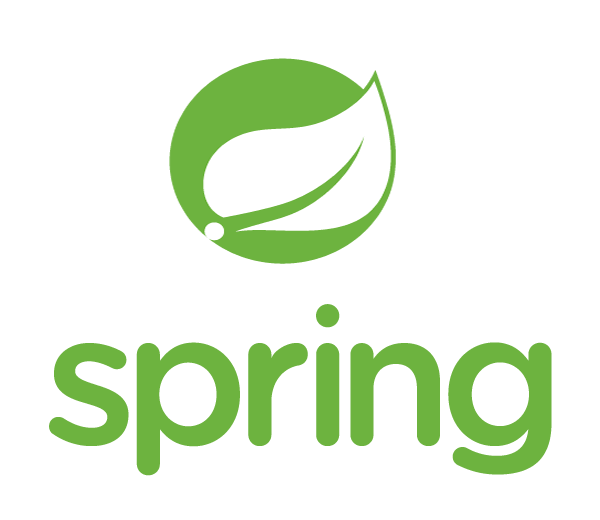

Before jumping into what Spring Boot is, we first need to discuss Spring and the Java ecosystem circa 2003. 

# Spring - Open Source to the Rescue

Java was in a rough state is 2003.  
Sun Microsystems was struggling to keep their core Java libraries up to date and expand its feature set.  
IBM provided a lot of these additional libraries and features to help enterprises wanting to use
Java's **['Write Once, Run Anywhere'](https://en.wikipedia.org/wiki/Write_once,_run_anywhere)** approach to software.  

One of those libraries that is important to our story is **['Enterprise Java Beans'](https://en.wikipedia.org/wiki/Jakarta_Enterprise_Beans)**, or **EJB** for short.  

**EJB is a Java API developed by IBM in the late 90’s to modularize construction of applications.**  
It was a go-to framework for enterprises needing to build Java applications.

**EJB had a lot of issues: it was complicated to onboard, difficult to change, and all around a pain to work with.**  
It also came with a caveat of not having a standardized approach to its usage.  This was often locked behind a paid service subscription
from IBM or buying their ready-made software.

**In 2003, the concept of ['Inversion of Control'](https://en.wikipedia.org/wiki/Inversion_of_control) was becoming a
well-defined pattern.**  
IBM utilized it in their EJB implementations, but was never a core concept of the framework and was limited in scope to
the EJB session bean.

**Spring brought ‘Inversion of Control’ to the masses**, no IBM required.  
It was fully open source, and its revolutionary IoC Container automated all the dependency injection.  **Spring was just significantly simpler to use in comparison to EJB.**

Soon Spring expanded their framework to include other helpful libraries that the core Java and IBM frameworks were lacking:

| Spring Library  | Description                                                               |
|-----------------|---------------------------------------------------------------------------|
| Spring MVC      | API for developing ‘Model, View, Controller’ web application patterns.    |
| Spring JDBC     | Universal database access API.                                            |
| Spring Security | Libraries to secure your java application.                                |
| Spring ORM      | Object relation API that can transform database tables into java objects. |
| Spring Test | Standardized API for testing applications.                                |

However, Spring soon had a similar problem that IBM ran into.  
Tons of customers were using Spring, but they were all implementing it in different ways.

**How can the Spring Team help customers when they are all using different approaches to implementing Spring?**  
The answer was the concept of **[‘Convention over Configuration’](https://en.wikipedia.org/wiki/Convention_over_configuration)**, and eventually the birth of the Spring Boot library.

# Spring Boot - The Opinionated way to Spring

**Spring Boot provides an opinionated way of developing Spring applications that fosters well tested code in a fast and easy way.**  
It was made by developers to make development easy, and it should come as no surprise that **using Spring without Spring
Boot is infinitely more difficult.**

It extends the Spring framework by providing:

- **‘starters’ that give an [‘Out of the Box’](https://en.wikipedia.org/wiki/Out_of_the_box_(feature)) approach to
  adding features to an application.**
- **Auto-configuration API that provides the mechanism for developing your own ‘starters’**
- **An embedded server for application deployment to help alleviate configuration complexity.  [(Make JAR not WAR!)](https://www.youtube.com/watch?v=sbPSjI4tt10&t=550s)**
- **Hooks for externalizing configuration.**
- **Metrics to tune and debug your application.**
- **Health Check concept to see if your application is running successfully or failing.**

# Spring Cloud - Pulling it All Together

Over the last 20 years, Spring and Spring Boot has created a wave of new development in the Java space.

**But how do these all of these new Spring Boot applications get configured and communicate with each other?**  
The Spring Teams answer was **Spring Cloud, which provides a suite of applications and libraries to facilitate communication and configuration between Spring Boot microservices.**

These applications and libraries include:

| Spring Cloud Library  | Description                                                                                                           |
|-----------------------|-----------------------------------------------------------------------------------------------------------------------|
| Config Server         | Configuration centralization and management.                                                                          |
| Discovery Server      | Discovering/registering of applications in a cloud ecosystem.                                                         |
| Gateway Server        | Centralized routing and rerouting service to manage multiple service endpoints.                                       |
| Load Balancing        | Load balancer to ensure horizontally scaled applications are properly served without overwhelming one over the other. |
| Circuit Breakers      | Quick fail library to prevent cascade failures when function/web calls fail.                                          |
| Distributed Messaging | libraries to simplify cross cloud communication.                                                                      |

# Conclusion - and Birds Eye View

- Java was struggling in 2003 to maintain its current code base and update new feature sets.
- IBM stepped in and created EJB libraries to help companies finding core Java lacking.
- Spring created a framework to make Dependency Injection trivial to compete with EJB by IBM.
- Spring expanded to included API’s for core features missing in the base Java API.
- Spring Boot created an implementation of ‘Convention over Configuration’ for the Spring Framework.
- Spring Cloud created a set of applications and libraries to facilitate configuration and communication between Spring Boot applications in a distributed systems. 

That about covers it for today! 
I'll be covering more of Spring, Spring Boot, and Spring Cloud in upcoming articles throughout the year, stay tuned!