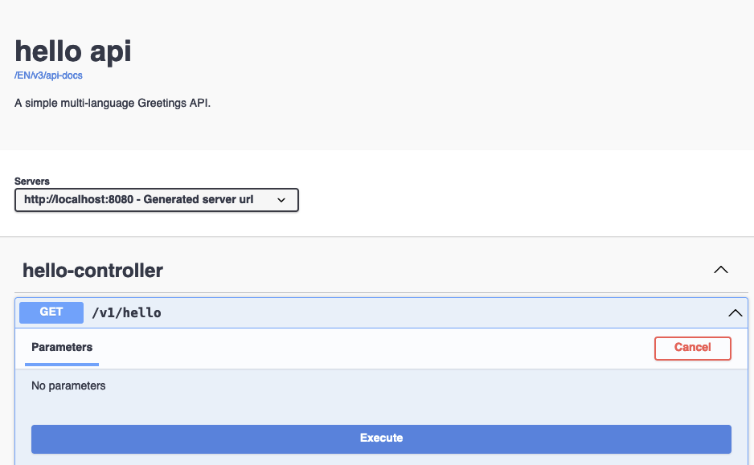

## Intro
Spring Cloud Gateway can help consolidate your API infrastructure into a single endpoint to handle all of your API routing.  
In addition, one of its best features is the integration with Open API (Swagger UI), which can combine your API documentation, all into one place!


_Consolidate all of your API's Documentation onto your API Gateway!_


_Provide a way to interact with all of your API's, all in one place!_

---

### _What is a REST API?_
A software architecture approach to building an HTTP based state (data) transfer application for the World Wide Web.  
These are the building blocks of microservices and usually provide data in the form of HTTP operations.

---
### _What is an API Gateway?_

An API Gateway serves to provide a simple yet effective way to route API requests.  
The diagram above demonstrates a typical multi 'micro-service' ecosystem.  The API Gateway provides an answer to
[cross-cutting concern's](https://en.wikipedia.org/wiki/Cross-cutting_concern)
by handling routing, authentication, logging and response caching.

---
### _What is Open API?_
Open API, formerly known as Swagger, is a specification for producing, describing, consuming, and visualizing web services (i.e. REST API's).
The most common use case is to document and provide an in-browser application to interact with the API.


_The front end application, Swagger UI, is an in-browser application that allows you to use your API._

---

## Sample Code
Let us take a look at a quick example to see how easy it is to consolidate all of your Open API Definitions using **Spring Cloud Gateway**.


This example has two services behind a gateway, both serving a translation of the greeting **'hello'**.  
Consumers can use your API Gateway to route to either the English or German translation of the greeting by simply changing
the URL: 
- api-gateway.com/**EN**/v1/hello 
- api-gateway.com/**GE**/v1/hello

---

### _REST API's_
The most relevant part, the REST Controller to respond to **'v1/hello'** requests with a translation of **'hello'**.
```java
@RequestMapping("/v1/hello")
@RestController
public class HelloController {

    String hello;

    public HelloController(@Value("${HELLO}") String hello) {
        this.hello = hello;
    }

    @GetMapping
    public Hello getHello(){
        return new Hello(hello);
    }
}

```

Here is the Open API Configuration for Swagger UI to display information on the landing page **./webjars/swagger-ui/index.html**
```java
@Configuration(proxyBeanMethods = false)
@OpenAPIDefinition(info = @Info(title = "${HELLO} api", description = "A simple multi-language Greetings API."))
public class SwaggerConfiguration {}
```

---

### _Spring Cloud Gateway_
Here is the routing configuration for Spring Cloud Gateway to correctly route to your two Greeting Applications:

| Gateway Route | Application                  |
|---------------|------------------------------|
| **/EN/****    | **English Greeting Service** |
| **/GE/****    | **Germain Greeting Service** |

```yaml
spring:
  cloud:
    gateway:
      routes:
        - id: english_route
          uri: ${ENGLISH_ROUTE:http://localhost:8080}
          predicates:
            - Path=/EN/**
          filters:
            - RewritePath=/EN/(?<segment>.*),/$\{segment}
        - id: german_route
          uri: ${GERMAN_ROUTE:http://localhost:8081}
          predicates:
            - Path=/GE/**
          filters:
            - RewritePath=/GE/(?<segment>.*),/$\{segment}
```

Spring Cloud Gateway also needs to find the Open API definitions of the downstream REST API's
(available through the **./v3/api-docs/swagger-config** endpoint of each API):
```yaml
springdoc:
  api-docs:
    enabled: true
  swagger-ui:
    enabled: true
    config-url: /v3/api-docs/swagger-config
    urls:
      - url: /EN/v3/api-docs
        name: English Greetings Service
      - url: /GE/v3/api-docs
        name: German Greetings Service
```

---

Spring Cloud Gateway will now serve all configured Open API definitions directly from its own Swagger UI page, available
at  **api-gateway.com/webjars/swagger-ui/index.html**!


_Consumers can now go to one place to find, view, and interact with all your API's available from the API Gateway!_

---

As always, the code for the [Spring Cloud Gateway](https://github.com/gleasonsean/spring-cloud-gateway-swagger-demo) 
and the [REST API's](https://github.com/gleasonsean/rest-api-demo) can be found on my [github](https://github.com/gleasonsean).
Thanks for reading, and until next time, _Keep your Platform Simple!_