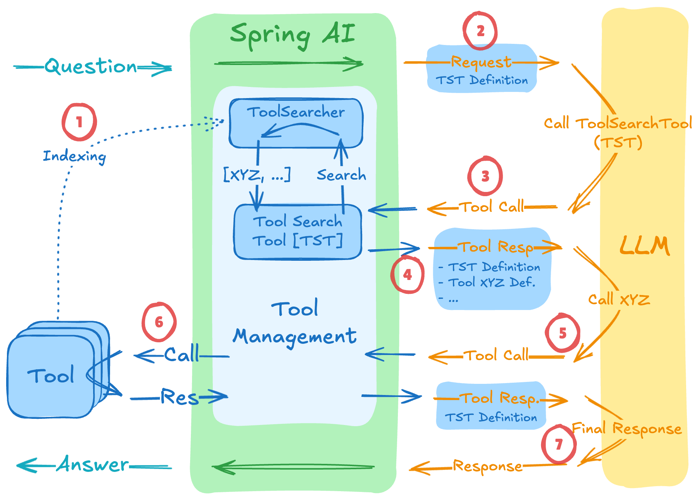

**Performance and observability are the two biggest hurdles in bringing AI Agents from a prototype to production.**

## The AI "Thinking" Tax


When we build AI Agents, we often rely on a "Chain of Thought" (CoT) approach. We want the model to reason through a
problem before it acts. In a typical implementation, this results in multiple round-trips:

1. **Turn 1:** The LLM outputs its reasoning ("I should check the weather to see if the user needs an umbrella").
2. **Turn 2:** The LLM calls the weather tool.
3. **Turn 3:** The LLM processes the tool output and gives a final answer.

While this makes the agent more accurate, it introduces significant latency. *
*_Every extra turn is another inference call, and every inference call costs time and money._**

## Enter the Tool Argument Augmenter

In his
recent [blog post](https://spring.io/blog/2025/12/23/explainable-ai-agents-capture-llm-tool-call-reasoning-with-spring-ai),
Christian Tzolov introduced a powerful new feature in Spring AI: the **Tool Argument Augmenter**.

This feature allows us to dynamically "inject" extra fields into a tool's JSON schema before it's sent to the LLM. The
model sees these extra fields (like `reasoning` or `confidence`) and is forced to fill them out *at the same time* it
provides the tool arguments.

*_By consolidating the reasoning and the action into a single turn, we effectively "speed up" the request by eliminating
unnecessary round-trips._**

## Non-Invasive Integration with MCP



MCP allows us to connect to remote tool servers. Often, we don't own these servers or the code running on them. The
Argument Augmenter is **non-invasive**; it intercepts the tool call on the client side.

You can add "thinking" requirements to a remote MCP tool without changing a single line of code on the MCP server
itself.

## Implementing the Augmenter

To implement this, you first define the extra fields you want the LLM to provide as a Java Record.

```java
public record ToolMetadata(
        @ToolParam(description = "Your step-by-step reasoning for calling this tool")
        String reasoning,
        @ToolParam(description = "Confidence score from 0.0 to 1.0")
        double confidence
) {
}
```

Next, you use the `ToolCallAdvisor` to register the augmenter. This advisor will "wrap" your tools and handle the
extraction of these fields before the actual tool logic is executed.

```java
var advisor = ToolCallAdvisor.builder()
        .withToolArgumentAugmenter(ToolMetadata.class, (metadata, context) -> {
            // This is where you handle the "augmented" data
            log.info("Agent Reasoning: {}", metadata.reasoning());
            log.info("Agent Confidence: {}", metadata.confidence());

            // You could even store this in a database for later audit!
        })
        .build();

// Add the advisor to your ChatClient
var chatClient = chatClientBuilder
        .defaultAdvisors(advisor)
        .build();
```

#### Why this matters for the Enterprise

In an enterprise environment, "Black Box" AI is a liability. We need to know *why* an agent decided to refund a customer
or access a specific file.

The Tool Argument Augmenter gives us **Explainable AI** without the performance penalty. We get the "inner monologue" of
the model captured right alongside the action it took.

## Conclusion

By using Spring AI's toolkit to augment tool arguments, we solve two problems at once: we make our agents faster by
reducing turns, and we make them safer by making their reasoning transparent.

If you are building complex agentic workflows with MCP, this should be a staple in your architecture.

That's it! Hopefully, this helps you squeeze some extra performance out of your AI implementations. If you made it this
far, thanks for reading, and I'll see you in the next one!
