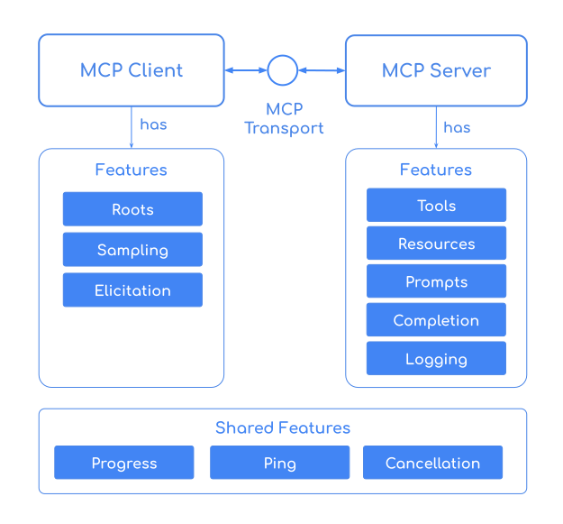

**Vendor lock-in is the silent killer of AI innovation.**

## The \"Platform-Specific\" Trap


As the LLM landscape evolves, we’re seeing a rise in model-specific \"skills\" or \"capabilities.\" Anthropic, for instance, has pioneered a powerful way to bundle instructions and scripts into discrete \"skills\" that their models can use. 

But what happens when you want to switch from Claude to GPT-4o, or even a local Llama 3 instance? Suddenly, your carefully crafted agent skills are useless because they were built for a specific provider's API.

**_To build future-proof agents, we need a way to define capabilities that are portable across any LLM._**

## Enter: Spring AI Generic Agent Skills

In his [January blog post](https://spring.io/blog/2026/01/13/spring-ai-generic-agent-skills), Christian Tzolov introduced a \"Model-Agnostic\" skill framework for Spring AI. Inspired by the \"Claude Code\" philosophy, this allows you to package instructions, scripts, and documentation into a modular folder structure that works with *any* model supported by Spring AI.

#### 1. LLM Portability (Model Agnostic)
The most significant benefit is freedom. You define your skill once using Markdown and standard scripts. Whether your backend is OpenAI, Anthropic, or Google Gemini, Spring AI handles the translation.

#### 2. Context Efficiency via Progressive Disclosure
Sending a massive 50-page instruction manual to an LLM \"just in case\" is a waste of tokens. Spring AI uses **Progressive Disclosure**:
*   **Discovery:** The agent only sees the name and a short description of the skill.
*   **Activation:** Only when the LLM decides it *needs* that skill does the full `SKILL.md` instruction set get injected into the context window.

**_This keeps your context window lean and your latency low._**

## Technical Deep Dive: The Skill Structure

A \"Skill\" in this framework is just a directory. No complex databases or proprietary formats required.

```text
my-agent-skills/
├── weather-lookup/
│   ├── SKILL.md       <-- Metadata and Instructions
│   └── scripts/       <-- Python/Node/Bash scripts
│       └── get_weather.py
└── database-query/
    ├── SKILL.md
    └── references/    <-- Documentation for the LLM
        └── schema.md
```

The `SKILL.md` file uses YAML frontmatter to tell Spring AI what the skill does:

```markdown
---
name: weather_lookup
description: \"Get current weather for a specific location\"
---
# Instructions
Use the bundled Python script to fetch real-time weather data.
Always provide the temperature in Celsius unless asked otherwise.
```

## Implementation: The SkillsTool

To enable this in your project, you use the `SkillsTool` from the `spring-ai-agent-utils` library. It works alongside `FileSystemTools` and `ShellTools` to give the LLM the ability to read its own instructions and execute its bundled scripts.

```java
// 1. Point to your skills directory
var skillsTool = new SkillsTool(\"path/to/my-agent-skills\");

// 2. Register with the ChatClient
var chatClient = chatClientBuilder
    .defaultTools(
        skillsTool, 
        new FileSystemTools(), 
        new ShellTools()
    )
    .build();
```

When a user asks, \"What's the weather like in Dublin?\", the flow is seamless:
1.  **Discovery:** The LLM sees the `weather_lookup` skill description.
2.  **Matching:** It realizes this skill matches the user's intent.
3.  **Execution:** It \"calls\" the skill, reads the `SKILL.md` instructions, and executes the `get_weather.py` script locally.

#### Why this is a Game Changer for the Enterprise



In an enterprise setting, you often need to run scripts that access local databases or internal APIs. Platform-hosted skills (like those in the cloud) can't easily reach your internal network. 

**_Because these skills run in your own Spring environment, they have full access to your local resources while remaining completely decoupled from the specific LLM provider._**

## Conclusion

By adopting a generic skill framework, we move away from \"Prompt Engineering\" for specific models and toward \"Capability Engineering\" for our applications. We get better context management, zero vendor lock-in, and the ability to share skills across teams and projects.

If you're looking to build complex agents that need to \"learn\" new tricks without bloating your codebase, generic skills are the way to go.

That's it! Hopefully, this helps you build more portable and efficient AI agents. If you made it this far, thanks for reading, and I'll see you in the next one!
